# Dan-Frych | System Programming | 2022

* ### [Lab 1 - Solver Threads](Resources/Lab1.png)

Детальніше

    1. Створити консольний застосунок, який запускає паралельне обчислення задач на обробку масивів різного типу та довжини. Тип задачі на обробку масиву підібрати самостійно (або з викладачем)
    Затримку внутрі функцій емулювати за допомогою Thread.Sleep

    2.Створити додаток Windows Forms, який по аналогії до консольного додатку обробляє масиви паралельними задачами.

### Результат:

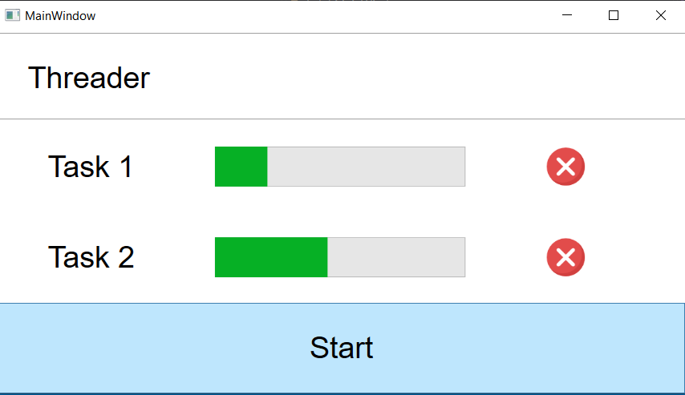

* ### [Lab 2 - Solver Async](Resources/Lab2.png)

Детальніше

    1. Створити консольний застосунок, який запускає паралельне обчислення задач на обробку масивів різного типу та довжини. Тип задачі на обробку масиву підібрати самостійно (або з викладачем)
    Затримку внутрі функцій емулювати за допомогою Thread.Sleep

    2.Створити додаток Windows Forms, який по аналогії до консольного додатку обробляє масиви паралельними задачами.

### Результат:

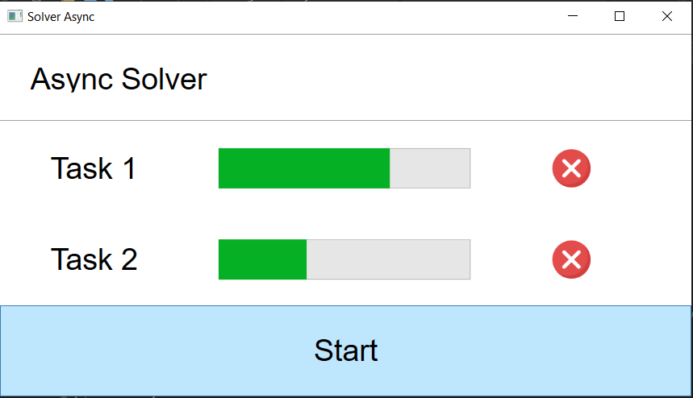

* ### [Lab 3 - Downloader](Resources/Lab3.png)

Детальніше

    Потрібно створити консольний та GUI застосунки для завантаження сторінок та файлів з Інтернету.
    Використовувати асинхронний доступ до файлів.
    В GUI-додатку для кожної сторінки відображати прогрес завантаження

### Результат:

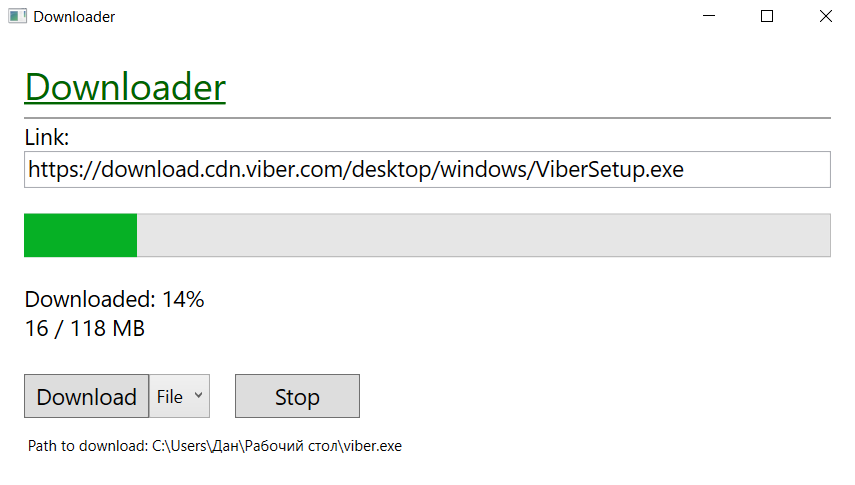

* ### [Lab 4 - Text Swapper](Resources/Lab4.png)

Детальніше

    
### Завдання:
    
Створити додаток WPF, який містить два текстові поля та дві кнопки - Change, Exit
При натисненні на Change текстові поля обмінюються змістом.
Якщо обидва поля пусті, то потрібно вивести Warning Dialog з повідомленням "Мінімум одне поле повинно містити текст".
При натисканні на кнопку Exit повинен виводитися діалого "Ви впевнені?" і  кнопки OK, Cancel. Додаток повинен завершуватися лише при натисканні на кнопку ОК

### Результат:

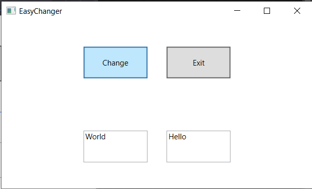

* ### [Lab 5 - Text Editor](Resources/Lab5.png)

Детальніше

    
### Завдання:
    
Створити додаток WPF, який містить TextBox як головний елемент.
Перед ним розмістити прапорці для вибору накреслення шрифту (CheckoBox). А також TextBox для введення розміру шрифта
На нижній панелі потрібно розмістити кнопки Зберегти, Вийти. Текст кнопок потрібно відформатувати різними кольорами

### Результат:

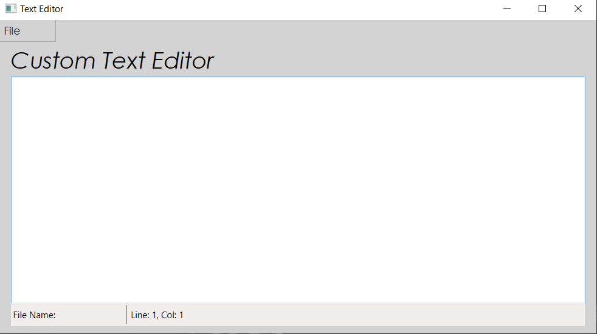

* ### [Lab 6 - Photo Viewer](Resources/Lab6.png)

Детальніше

    
### Завдання:
    
Створити додаток для перегляду графічних файлів, який має відповідати таким вимогам:

* Мати ліву панель, у якій буде відображатися історія відкритих файлів (список)
* Остання частину візуального інтерфейсу повинен займати компонент, який дозволяє переглядати файл
* Передбачити панель меню та статус-панель
* Меню повинно містити пункти - Відкрити, Закрити, Вийти з додатку

### Результат:

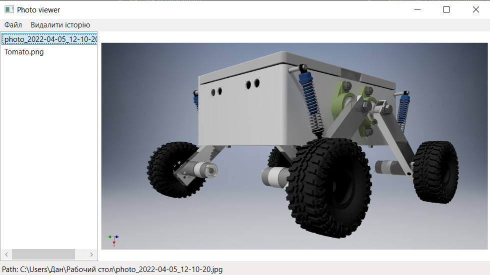

* ### [Lab 7 - Bank Payment](Resources/Lab7.png)

Детальніше

    
### Завдання:
    
Створити додаток для створення платежу.

Він має містити такі елементи керування:

* текстове поле "Відправник"
* текстове поле "Отримувач"
* текстове поле "Сума"
* текстове поле "Призначення платежу"
* кнопка "Зберегти"
* кнопка "Завантажити"
* список "Формати", який повинен містити два формати - bin, xml

Створити серіалізований клас BankPayment, який буде містити відповідні властивості, а також дату створення платежу.

Створити об'єкт класу BankPayment та прив'язати його властивості до елементів керування.

При натисканні кнопки "Зберегти" об'єкт класу повинен записатися у файл у вибраному форматі

### Результат:

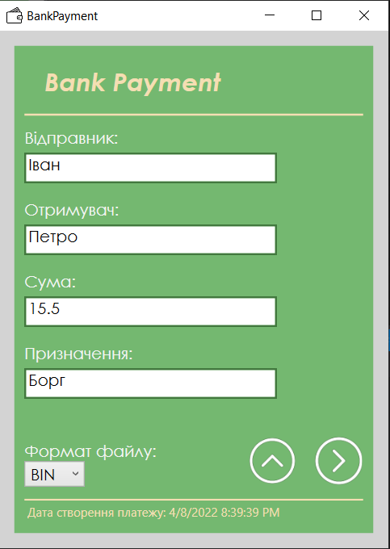

* ### [Lab 8 - Text Editor](Resources/Lab8.png)

Детальніше

    
### Завдання:
    
Створити простий текстовий редактор, у якого буде головне меню з пунктами
    File > New
    File > Open ... (Ctrl + O)
    File  > Save (Ctrl + S) - неактивне, якщо немає змін у тексті
    File > Save as ...
    File > Exit (Esc)

    Edit > Cut - неактивне, якщо немає виділеного тексту
    Edit > Copy - неактивне, якщо немає виділеного тексту
    Edit > Paste - неактивне, якщо буфер обміну пустий

Під панеллю меню потрібно розмістити панель інструментів з кнопками, які дублюють команди меню.
Під полем редагування тексту потрібно розмістити панель статусу з двома секціями

1-а секція показує поточне положення текстового курсору.
2-а секція показує ім'я файлу, який зараз редагується

Всі пункти меню та кнопки панелі інструментів повинні містити іконки

### Результат:

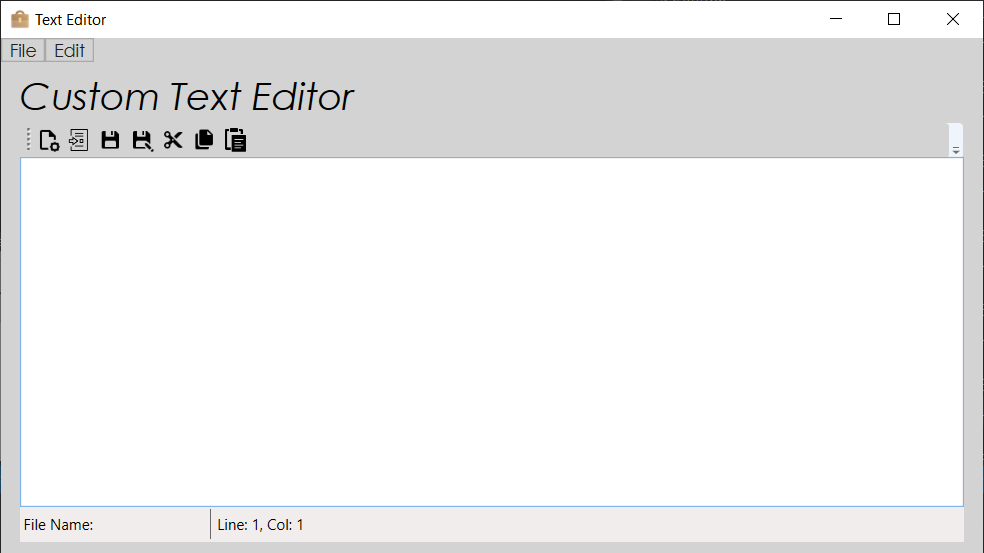

* ### [Lab 9 - Paint](Resources/Lab9.png)

Детальніше

    
### Завдання:
    
Створити простий графічний редактор, у якого буде головне меню з пунктами
File > New
File > Open ... (Ctrl + O)
File  > Save (Ctrl + S) - неактивне, якщо немає змін у малюнку
File > Save as ...
File > Exit (Esc)

Edit > Cut - неактивне, якщо немає виділеного фрагменту малюнка
Edit > Copy - неактивне, якщо немає виділеного фрагменту малюнка
Edit > Paste - неактивне, якщо буфер обміну пустий

Edit > Color - задає колір малювання
Edit > Brush - задає колір заливки

Edit > Tools > Point - точка
Edit > Tools > Line - лінія
Edit > Tools > Rect - прямокутник
Edit > Tools > Ellipse - еліпс

Під панеллю меню потрібно розмістити панель інструментів з кнопками, які дублюють команди меню.

Під полем редагування тексту потрібно розмістити панель статусу з двома секціями

1-а секція показує поточне положення курсору миші.
2-а секція показує ім'я файлу, який зараз редагується

Всі пункти меню та кнопки панелі інструментів повинні містити іконки

Додати контекстне меню для виділених фрагментів малюнку

### Результат:

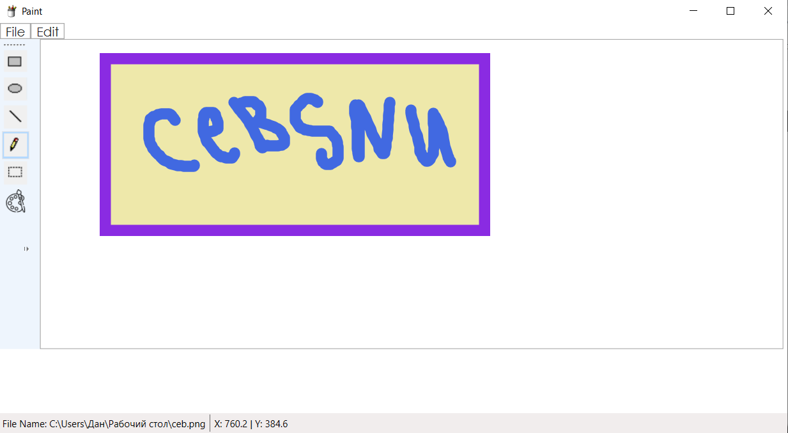

* ### [Lab 10 - DialogBox](Resources/Lab10.png)

Детальніше

    
### Завдання:
    
До раніше створених текстових редакторів та переглядачів файлів додати діалог налаштувань, у якому задаються шрифти, кольори, типи файлів.

### Результат:

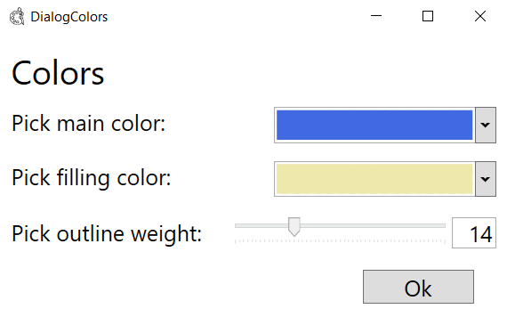

* ### [Lab 11 - FileSearch](Resources/Lab11.png)

Детальніше

    
### Завдання:
    
Необхідно створити утиліту для пошуку файлів за заданим набором параметром.

### Результат:

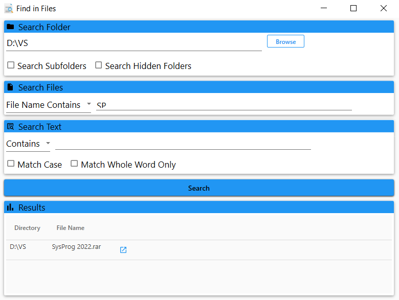

* ### [Lab 12 - FileExplorer](Resources/Lab12.png)

Детальніше

    
### Завдання:
    
Проста утиліта для керування файловою системою як-то стандартна програма "File explorer" у Windows.
Ліва частина основного вікна програми містить диски та папки. Права частина - вміст вибраної папки.
Використати компоненти TreeView, ListView.
Розширити можливості цієї утиліти за допомогою елементу TabControl у правій частині. Надати користувачу можливість відкривати вибрану папку у новій вкладці праворуч. При перемиканні вкладок вузол у дереві папок повинен відповідати вибраному елементу.
Передбачити відкладену ініціалізацію дочірніх вузлів бразура файлів.
Додати контекстне меню до вузлів дерева.
У елементі ListView папки повинні йти першими. Файли повинні відображатися зі своїми іконками
Відображення вмісту відповідного вузла дерева у ListView повинна бути асинхронною
### Результат:

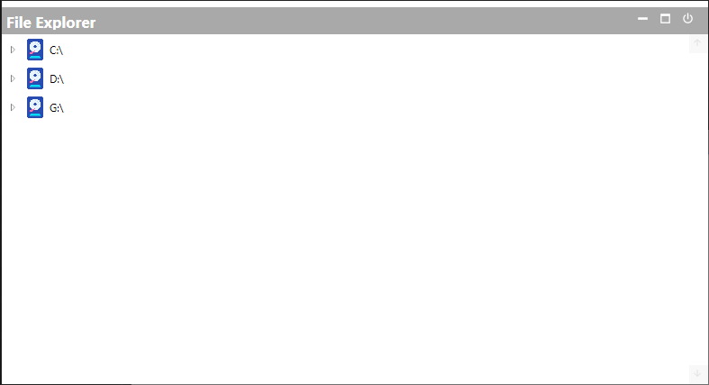

* ### [Lab 13 - AudioPlayer](Resources/Lab12.png)

Детальніше

    
### Завдання:
    
Використовуючи приклад медіа програвача як основу, змінити дизайн додатку.
Зліва - панель папок із медіа файлами у вигляді дерево (як у файловому браузері)
Праворуч - панель програвача з кнопками керування.
Ще праворуч потрібно додати панель з історією програних файлів. Панель повинна бути прихована і відображатися по кліку кнопки

### Результат:

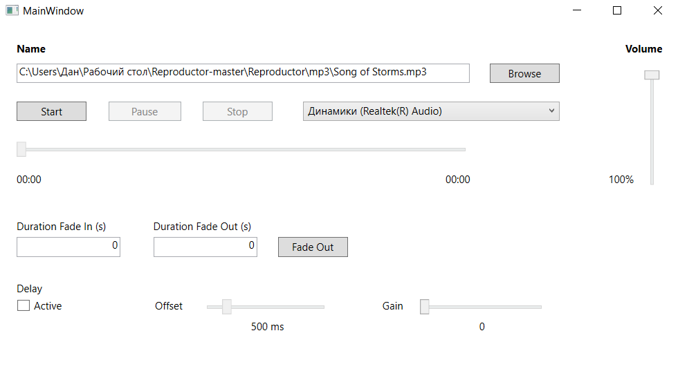

* ### [Lab 13 - AudioPlayer](Resources/Lab12.png)

Детальніше

    
### Завдання:

Створити програму "Аудіо Книга", яка має такі можливості:
зчитує текстовий файл та синтезує аудіо із прочитаного тексту.
генерує текст із завантаженого аудіо файлу
Можна використовувати сторонні бібліотеки. В репозиторії повинен бути короткий опис бібліотеки та  посилання на документацію до неї

### Результат:

